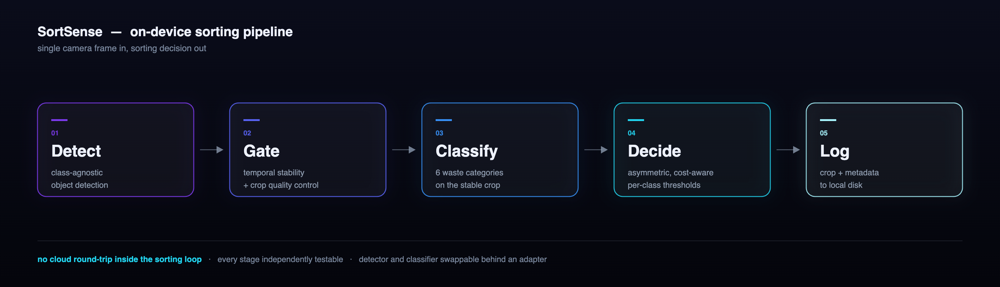

<h1 align="center">SortSense</h1>

<p align="center"><b>Real-time waste sorting with on-device computer vision.</b></p>

<p align="center">
  
  
  
  
  
  
</p>

<p align="center">
  
</p>

---

SortSense is an end-to-end pipeline that turns a single camera frame into a sorting decision &mdash; object detection, waste-category classification, and a cost-aware policy that decides whether to trust the prediction or reject it &mdash; designed to run fully on-device on embedded hardware (Jetson-class SBCs), with no cloud round-trip required for the sorting decision itself.

This repository is a curated, from-scratch write-up of the system's architecture and engineering process. It deliberately does **not** include the trained model weights, the calibrated production thresholds, the training dataset, or deployment-specific configuration &mdash; those are the parts that took the most iteration to get right, and stay private for now.

---

## Results

| Measurement | Value |
|---|---|
| Classifier, 6 classes, frozen test set | **macro-F1 0.968 &plusmn; 0.010** across 3 seeds |
| Detector hit-rate, after backbone migration | **88.8%** (up from 81.2%) |
| Contamination rate vs. naive top-1 decision | **&minus;68%** |
| Average decision cost vs. naive top-1 | **&minus;44%** |
| Cost paid for it: rejection rate | **+51%** (deliberate) |
| Automated regression suite | **16 / 16 passing**, one command |
| Unattended camera loop | 3000-frame soak, no sustained RSS growth |

All figures come from my own held-out evaluation, not a public benchmark. See [Known limits](#known-limits) before reading too much into them.

---

## Why this exists

Recycling contamination &mdash; the wrong material in the wrong bin &mdash; is one of the main reasons collected waste ends up in landfill instead of being recycled. A sorting assistant that gives real-time feedback at the point of disposal, *before* contamination happens, is cheap to deploy compared to sorting-facility infrastructure, and can run on low-cost embedded hardware.

---

## Architecture

```
camera frame
     |
     v
[ 1. Detector ]          class-agnostic object detection (YOLOX, Apache-2.0
     |                   license -- chosen deliberately over YOLOv8/AGPL for
     |                   commercial-use compatibility, see engineering notes)
     v
[ 2. Stability &         rejects transient/blurry frames; only a
     presence tracker ]  temporally-stable, well-formed crop proceeds
     |
     v
[ 3. Classifier ]        waste-category classification (6 classes) on the
     |                   cropped region
     v
[ 4. Decision policy ]   asymmetric confidence thresholds, calibrated
     |                   per-class to weigh "false accept" (contamination)
     |                   against "false reject" (missed recyclable)
     v
[ 5. Crop logger ]       every processed frame, accepted or rejected, is
                         logged locally with its metadata from day one, so
                         real-world data exists before any cloud or active-
                         learning layer is built on top of it
```

Each stage is a separate, independently testable module. The detector and classifier are swappable behind a thin adapter interface &mdash; the project migrated detector backbones once already without touching the decision logic downstream.

---

## Engineering notes

<details open>
<summary><b>Detector license migration</b></summary>

<br>

The initial detector choice (YOLOv8) carries an AGPL-3.0 license, incompatible with a closed-source commercial product. Migrated to YOLOX (Apache-2.0) behind a class-agnostic adapter: six downstream consumer modules updated, core product logic (crop quality control) untouched. Hit-rate improved as a side effect, ~88.8% vs ~81.2% on an internal detection sample.

The lesson worth keeping: the adapter boundary was drawn before it was needed, which is why swapping the backbone was a six-file change instead of a rewrite.

</details>

<details>
<summary><b>Asymmetric decision thresholds, not one confidence cutoff</b></summary>

<br>

Treating every misclassification as equally costly is wrong here. A contaminated recyclable stream is more expensive to fix downstream than a recyclable item conservatively routed to "unsure." Thresholds are calibrated per class against a declared cost asymmetry, trading a higher rejection rate for a large drop in contamination rate.

</details>

<details>
<summary><b>6 explicit classes, not 5 classes plus a rejection bucket</b></summary>

<br>

Tested both formulations rather than assuming. Residual waste turned out to have its own visual signature &mdash; it is not simply "low confidence on everything else." The rejection-based formulation was roughly 4.5&times; worse at equivalent coverage, so the explicit sixth class stayed.

</details>

<details>
<summary><b>Data logging before any cloud or ML-ops layer</b></summary>

<br>

Crop capture and local logging were deliberately built before any cloud upload or active-learning pipeline, specifically so real operating data would exist before betting engineering time on infrastructure for data that did not exist yet.

An internal review later flagged that some downstream infrastructure had been built ahead of data volume anyway. That was documented, deprioritised, and corrected &mdash; a useful lesson in sequencing that is more valuable than pretending it did not happen.

</details>

<details>
<summary><b>Camera-loop hardening</b></summary>

<br>

Long-running unattended operation needs to survive a camera dropping out. Reconnection uses exponential backoff with a bounded retry count, tested with dependency-injected fakes so the failure paths are exercised without a real camera. A dedicated stress harness cycles real images through the full production pipeline for thousands of iterations, sampling RSS to catch slow leaks a short interactive session would never reveal.

</details>

<details>
<summary><b>Label quality auditing</b></summary>

<br>

The full dataset was audited for label noise and corrections were applied by hand rather than trusted to an automated pass. Dominant failure mode: glossy and laminated packaging read as paper. Ambiguous cases that needed a domain rule rather than a judgement call were left explicitly open instead of being silently resolved.

</details>

<details>
<summary><b>Testing</b></summary>

<br>

Every module has direct-assert tests, run with one command. No pytest dependency &mdash; a single script discovers and runs every `test_*.py` module and reports pass/fail counts, intentionally simple so it is obvious what is and is not covered.

</details>

---

## Known limits

Stated plainly, because a metric without a caveat is marketing:

- The decision thresholds are calibrated **and** evaluated on the same validation split. That is an optimistic upper bound, not evidence of generalisation. Re-validation against live field data is queued.
- The cost asymmetry driving those thresholds is a declared assumption, not yet confirmed with a real waste-management operator.
- Hardware-accelerated inference on the target board is not yet done &mdash; the board is not in my hands yet. Pipeline logic is validated end to end on a live webcam feed; the throughput work is not.
- Known detection failure modes, inherited from the pre-trained detector's distribution: unstructured piles, objects filling the entire frame, and transparent glass.

---

## Status

Actively developed. Detection and classification pipeline validated on a held-out test set; decision-policy calibration validated against a declared, not yet field-verified, cost assumption; long-run stability tested via synthetic stress runs. Physical deployment work is in progress.

---

## License

MIT &mdash; see [LICENSE](LICENSE). Model weights, calibrated thresholds, and training data are not included in this repository.
